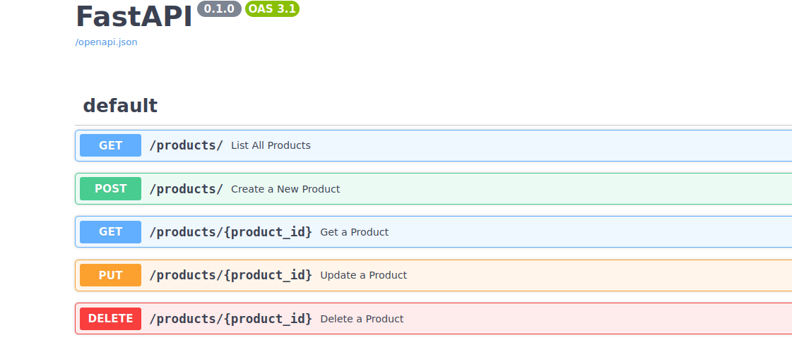

# TrueFan-Assignment

## Step 1: 
Create an virtual env and enable it 
```python 
python3 -m venv venv
source venv/bin/activate
```
## Step 2: 
Install all requirement packages using 
```python 
pip install -r requirements.txt
```

## Step 3: 
Run the main.py file in the app directory 
```python
python3 app/main.py
```

#### Access the Swagger Documention from: [Swagger Docs](http://0.0.0.0:5000/docs#/)

